# Entity-Relationship Diagram — Hedgie Hub

Reconstructed from the full migration history (`supabase/migrations/`, 87 files) plus
verification against current application code. See `MEDALLION_ARCHITECTURE.md` for how
data flows between these layers, and `SEQUENCE_DIAGRAMS.md` for how each integration
populates the Bronze layer.

## Layers

- **Bronze** (Postgres schema `bronze`) — raw external-system snapshots, UPSERT for idempotency, never deleted.
- **Local** (schema `public`) — operational data this app owns; normal CRUD; source of truth for these tables; not reprocessed.
- **Silver** (schema `public`) — canonical computed state, rebuilt from Bronze+Local via atomic Postgres functions (`reprocess_*_atomic`) using DELETE+INSERT (or UPSERT-by-email for `members`, to preserve UUIDs).
- **Legacy / orphaned** — tables still present in the database that predate the medallion refactor. Two (`member_metrics`, `member_engagement`) are still *read* by a couple of pages but have no writer anywhere in the codebase, so they're permanently stale/empty in practice — the `2026-08-23` commit "Compute real engagement metrics for admin member pages" moved engagement math to on-demand queries instead of relying on them. Two more (`prickle_popularity`, `activity_types`) have zero references anywhere in application code. Kept here for completeness since nothing has dropped them, but treat any of the four as dead weight, not documentation of current behavior.
- Two Bronze tables are **deprecated-but-present**: `subscription_history` (superseded by `kajabi_purchases`, kept only for historical reference) and legacy `kajabi_members` (written only by the old CSV-upload path `/api/import/members`; its reprocessing trigger call passes a table name that isn't in `SILVER_DEPENDENCIES`, so it's a no-op — the form still exists in the admin UI but doesn't actually feed Silver).

Solid lines (`--`) are enforced foreign keys. Dashed lines (`..`) are either a natural-key
value match with **no enforced FK** (e.g. `zoom_meeting_uuid`), or a Bronze/Local →
Silver "processed into" relationship from the ETL logic in `lib/processing/trigger.ts`
and the `/api/process/*` routes — not a database constraint.

```mermaid
erDiagram
    %% ========================================
    %% BRONZE LAYER — schema `bronze`, raw external snapshots
    %% ========================================

    kajabi_contacts {
        uuid id PK
        text kajabi_contact_id UK
        text email
        text name
        timestamptz created_at_kajabi
        timestamptz updated_at_kajabi
        timestamptz imported_at
        jsonb data
    }

    kajabi_customers {
        uuid id PK
        text kajabi_customer_id UK
        text email
        text name
        timestamptz created_at_kajabi
        timestamptz updated_at_kajabi
        timestamptz imported_at
        jsonb data
    }

    kajabi_purchases {
        uuid id PK
        text kajabi_purchase_id UK
        text kajabi_customer_id "no FK, value match"
        text kajabi_offer_id "no FK, value match"
        int amount_in_cents
        text currency
        text status "derived from deactivated_at"
        timestamptz created_at_kajabi
        timestamptz effective_start_at
        timestamptz deactivated_at
        timestamptz imported_at
        jsonb data
    }

    kajabi_offers {
        uuid id PK
        text kajabi_offer_id UK
        text name
        text status
        int trial_period_days
        timestamptz imported_at
        jsonb data
    }

    kajabi_members {
        uuid id PK
        text email
        timestamptz imported_at
        jsonb data
        text _legacy "DEPRECATED: CSV-import path only, reprocess trigger is a no-op"
    }

    subscription_history {
        uuid id PK
        text kajabi_subscription_id
        text customer_email
        text status
        text offer_title
        timestamptz created_at_kajabi
        timestamptz imported_at
        jsonb data
        text _deprecated "DEPRECATED: use kajabi_purchases instead"
    }

    stripe_customers {
        uuid id PK
        text stripe_customer_id UK
        text email
        text name
        timestamptz created_at_stripe
        timestamptz imported_at
    }

    stripe_products {
        uuid id PK
        text stripe_product_id UK
        text name
        boolean active
        timestamptz imported_at
    }

    stripe_subscriptions {
        uuid id PK
        text stripe_subscription_id UK
        text stripe_customer_id "no FK, value match"
        text status
        jsonb pause_collection
        timestamptz current_period_start
        timestamptz current_period_end
        timestamptz canceled_at
        timestamptz imported_at
    }

    calendar_events {
        uuid id PK
        text google_event_id UK
        text summary
        text description
        text location
        timestamptz start_time
        timestamptz end_time
        text creator_email
        text organizer_email
        jsonb raw_data
        timestamptz imported_at
    }

    zoom_meetings {
        uuid id PK
        text meeting_uuid UK
        text meeting_id
        text topic
        timestamptz start_time
        timestamptz end_time
        int duration_minutes
        text host_email
        text host_name
        jsonb data
        timestamptz imported_at
    }

    zoom_attendees {
        uuid id PK
        text meeting_id
        text meeting_uuid "no FK, value match"
        text name
        text email
        timestamptz join_time
        timestamptz leave_time
        int duration
        jsonb raw_payload
        timestamptz created_at
    }

    slack_users {
        uuid id PK
        text user_id UK
        text email
        text real_name
        boolean is_bot
        boolean is_deleted
        jsonb raw_payload
        timestamptz imported_at
    }

    slack_channels {
        uuid id PK
        text channel_id UK
        text name
        boolean is_private
        boolean is_archived
        jsonb raw_payload
        timestamptz imported_at
    }

    slack_messages {
        uuid id PK
        text message_ts
        text channel_id
        text channel_name
        text user_id
        text text
        text thread_ts
        timestamptz occurred_at
        timestamptz deleted_at
        jsonb raw_payload
        timestamptz imported_at
    }

    slack_reactions {
        uuid id PK
        text message_ts
        text channel_id
        text channel_name
        text reaction
        text user_id
        timestamptz occurred_at
        timestamptz removed_at
        jsonb raw_payload
        timestamptz imported_at
    }

    %% ========================================
    %% LOCAL LAYER — schema `public`, operational source of truth
    %% ========================================

    staff {
        uuid id PK
        text name
        text email UK
        text role "owner | staff | contractor"
        date hire_date
        uuid user_id FK "auth.users, ON DELETE SET NULL"
        timestamptz created_at
    }

    prickle_types {
        uuid id PK
        text name UK
        text normalized_name UK
        text description
        boolean requires_host
        uuid default_host_id FK "members, ON DELETE SET NULL"
        timestamptz created_at
    }

    member_name_aliases {
        uuid id PK
        uuid member_id FK "members, ON DELETE CASCADE"
        text alias UK
        text source "zoom | slack"
        timestamptz created_at
    }

    member_email_aliases {
        uuid id PK
        text canonical_email "no FK, value match on members.email"
        text alias_email UK
        text source "manual | auto_detected"
        timestamptz created_at
    }

    ignored_zoom_names {
        uuid id PK
        text zoom_name UK
        text reason
        uuid ignored_by FK "auth.users, ON DELETE SET NULL"
        timestamptz ignored_at
    }

    ignored_slack_users {
        text user_id PK
        text reason
        timestamptz created_at
    }

    member_hiatus_history {
        uuid id PK
        uuid member_id FK "members, ON DELETE CASCADE"
        date start_date
        date end_date
        text reason
        timestamptz created_at
    }

    member_status_overrides {
        uuid id PK
        uuid member_id FK "members, ON DELETE CASCADE"
        text override_type "hiatus | gift | special"
        text reason
        timestamptz starts_at
        timestamptz expires_at
        uuid created_by FK "auth.users"
        timestamptz created_at
    }

    ambiguous_zoom_names {
        uuid id PK
        text zoom_name
        text zoom_email
        uuid_array candidate_member_ids
        int occurrence_count
        text status "unresolved | resolved | ignored"
        uuid resolved_member_id FK "members"
        timestamptz first_seen_at
        timestamptz last_seen_at
    }

    unmatched_calendar_events {
        uuid id PK
        uuid calendar_event_id FK "bronze.calendar_events, UK, ON DELETE CASCADE"
        text raw_summary
        text suggested_type
        text suggested_host
        text status "pending | resolved | ignored"
        uuid resolved_type_id FK "prickle_types, ON DELETE SET NULL"
        timestamptz resolved_at
    }

    user_profiles {
        uuid id PK "FK auth.users, ON DELETE CASCADE"
        text email
        text role "admin | assistant | member"
        text timezone_preference
        timestamptz created_at
    }

    user_feature_previews {
        uuid user_id PK "FK auth.users, ON DELETE CASCADE"
        text feature_key PK
        timestamptz enabled_at
    }

    dismissed_duplicate_groups {
        text group_key PK
        timestamptz dismissed_at
    }

    %% ========================================
    %% SILVER LAYER — schema `public`, canonical state
    %% Written by reprocess_members_atomic / reprocess_prickles_atomic /
    %% reprocess_prickle_attendance_atomic (see MEDALLION_ARCHITECTURE.md)
    %% ========================================

    members {
        uuid id PK
        text name
        text email UK
        timestamptz joined_at
        text status "active | inactive | on_hiatus"
        text plan
        text source "kajabi | staff"
        text staff_role "owner | staff | contractor | null"
        uuid user_id FK "auth.users, ON DELETE SET NULL"
        text kajabi_id
        text stripe_customer_id
        text photo_url
        text bio
        text instagram_url
        text facebook_url
        text twitter_url
        timestamptz updated_at
    }

    prickles {
        uuid id PK
        text title
        uuid host FK "members, ON DELETE SET NULL"
        uuid type_id FK "prickle_types, ON DELETE SET NULL"
        text type "legacy free-text, superseded by type_id"
        timestamptz start_time
        timestamptz end_time
        text source "calendar | slack | sheets | zoom"
        uuid calendar_event_id FK "bronze.calendar_events, UK if set, ON DELETE SET NULL"
        text zoom_meeting_uuid "no FK, value match; UK w/ start+end if set"
        timestamptz created_at
    }

    prickle_attendance {
        uuid id PK
        uuid member_id FK "members, ON DELETE CASCADE"
        uuid prickle_id FK "prickles, ON DELETE CASCADE"
        timestamptz join_time
        timestamptz leave_time
        text confidence_score "high | medium | low"
        timestamptz created_at
    }

    member_activities {
        uuid id PK
        uuid member_id FK "members, ON DELETE CASCADE"
        text activity_type
        text activity_category
        text title
        text description
        jsonb metadata
        uuid prickle_id FK "prickles, ON DELETE SET NULL, optional"
        text related_id
        int engagement_value
        timestamptz occurred_at
        text source "slack"
        timestamptz created_at
    }

    %% ========================================
    %% LEGACY / ORPHANED — present in DB, not part of current pipeline
    %% ========================================

    member_metrics {
        uuid member_id PK "FK members, ON DELETE CASCADE"
        timestamptz last_attended_at
        int prickles_last_7_days
        int prickles_last_30_days
        int total_prickles
        int engagement_score
        text _status "read-only in app code, never written — always stale"
    }

    member_engagement {
        uuid member_id PK "FK members, ON DELETE CASCADE"
        text risk_level "high | medium | low"
        text engagement_tier "highly_engaged | active | at_risk"
        double churn_probability
        text _status "read-only in app code, never written — always stale"
    }

    prickle_popularity {
        uuid prickle_id PK "FK prickles, ON DELETE CASCADE"
        double avg_attendance
        text trend "increasing | stable | decreasing"
        text _status "zero references in application code"
    }

    activity_types {
        text code PK
        text name
        text category
        int default_engagement_value
        text _status "zero references in application code"
    }

    %% ========================================
    %% Enforced foreign keys (solid lines)
    %% ========================================

    members ||--o{ prickles : "hosts (optional)"
    members ||--o{ prickle_attendance : "attended"
    prickles ||--o{ prickle_attendance : "had attendees"
    members ||--o{ prickle_types : "default host for (optional)"
    prickle_types ||--o{ prickles : "categorized as"
    members ||--o{ member_name_aliases : "has aliases"
    members ||--o{ member_hiatus_history : "has hiatuses"
    members ||--o{ member_status_overrides : "has overrides"
    members ||--o{ ambiguous_zoom_names : "resolved to (optional)"
    prickle_types ||--o{ unmatched_calendar_events : "resolved type (optional)"
    calendar_events ||--o{ unmatched_calendar_events : "flagged unmatched"
    calendar_events ||--o{ prickles : "calendar_event_id (optional)"
    members ||--o{ member_activities : "performed"
    prickles ||--o{ member_activities : "occurred during (optional)"
    members ||--o{ member_metrics : "has metrics (legacy)"
    members ||--o{ member_engagement : "has engagement (legacy)"
    prickles ||--o{ prickle_popularity : "has popularity (legacy)"

    %% ========================================
    %% Natural-key value matches — no enforced FK (dashed)
    %% ========================================

    zoom_meetings ||..o{ zoom_attendees : "meeting_uuid"
    zoom_meetings ||..o{ prickles : "zoom_meeting_uuid"
    kajabi_customers ||..o{ kajabi_purchases : "kajabi_customer_id"
    kajabi_offers ||..o{ kajabi_purchases : "kajabi_offer_id"
    stripe_customers ||..o{ stripe_subscriptions : "stripe_customer_id"

    %% ========================================
    %% ETL "processed into" relationships — logical, not FK (dashed)
    %% See MEDALLION_ARCHITECTURE.md and SEQUENCE_DIAGRAMS.md for the actual flow
    %% ========================================

    kajabi_contacts }o..o{ members : "processed into"
    kajabi_customers }o..o{ members : "processed into (profile fields)"
    kajabi_purchases }o..o{ members : "processed into (status, plan)"
    kajabi_offers }o..o{ members : "processed into (plan, trial)"
    staff }o..o{ members : "merged into (always active)"
    stripe_customers }o..o{ members : "stripe_customer_id backfill"
    member_email_aliases }o..o{ members : "email resolution"
    calendar_events }o..o{ prickles : "processed into (calendar-sourced)"
    zoom_attendees }o..o{ prickle_attendance : "processed into"
    zoom_attendees }o..o{ prickles : "processed into (PUP segments, zoom-sourced)"
    member_name_aliases }o..o{ prickles : "host name matching"
    member_name_aliases }o..o{ prickle_attendance : "attendee name matching"
    ignored_zoom_names }o..o{ prickle_attendance : "excluded from matching"
    slack_messages }o..o{ member_activities : "processed into"
    slack_reactions }o..o{ member_activities : "processed into"
    slack_users }o..o{ member_activities : "user matching"
    ignored_slack_users }o..o{ member_activities : "excluded from matching"
```

## Notes on things that look inconsistent but aren't bugs

- **`members.status` has three values but Kajabi processing only ever sets `active`/`inactive`.** `on_hiatus` is set via a separate path (`member_status_overrides` / `/api/process/hiatus`), not by the Kajabi sync — see `SUBSCRIPTION_ACTION_ITEMS.md`.
- **`prickles.type` (free text) coexists with `prickles.type_id` (FK).** `type` was superseded by `type_id` + `prickle_types` in `20260405070000` but never dropped. Current processing code only writes `type_id`.
- **`member_email_aliases` vs `member_name_aliases` are two different tables**, not a rename — `member_email_aliases` dedupes Kajabi contacts by email during member processing; `member_name_aliases` maps Zoom/Slack display names to a member for attendance/activity matching. Both are Local, both are hand-maintained (plus some auto-inserts from `reprocess_members_atomic` on email change).
- **No table is named `attendance` anymore** — it was renamed to `prickle_attendance` in `20260422000001`. `CLAUDE.md`'s attendance-design rules still apply verbatim to `prickle_attendance`.
