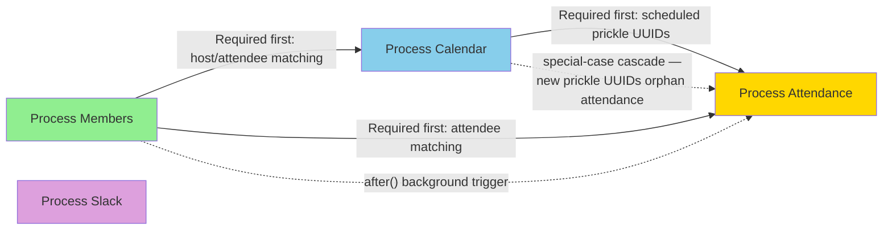

# Medallion Architecture - Hedgie Hub

## Overview

This system uses a **Medallion Architecture** with Bronze (raw imports), Local (operational), and Silver (canonical) layers. A "Gold" layer was originally planned as pre-aggregated tables but never got wired up — see the note at the end of this doc.

For full column-level detail see `ERD.md`. For how each integration actually gets data into Bronze (webhook vs. cron), see `SEQUENCE_DIAGRAMS.md`.

## Data Flow Diagram

```mermaid
graph TB
    subgraph "External Sources"
        Kajabi[Kajabi API<br/>Contacts, Customers,<br/>Purchases, Offers]
        Zoom[Zoom API<br/>Meetings & Attendees]
        Calendar[Google Calendar<br/>Scheduled Events]
        Slack[Slack API<br/>Messages & Reactions]
        Stripe[Stripe API<br/>Comparison only —<br/>Kajabi is system of record]
    end

    subgraph "Bronze Layer - Raw Imports (UPSERT), schema bronze"
        BronzeKajabi[(kajabi_contacts<br/>kajabi_customers<br/>kajabi_purchases<br/>kajabi_offers)]
        BronzeZoom[(zoom_meetings<br/>zoom_attendees)]
        BronzeCalendar[(calendar_events)]
        BronzeSlack[(slack_users<br/>slack_channels<br/>slack_messages<br/>slack_reactions)]
        BronzeStripe[(stripe_customers<br/>stripe_products<br/>stripe_subscriptions)]
    end

    subgraph "Local Layer - Operational Data (CRUD), schema public"
        LocalAliases[(member_name_aliases<br/>member_email_aliases)]
        LocalHiatus[(member_hiatus_history<br/>member_status_overrides)]
        LocalIgnored[(ignored_zoom_names<br/>ignored_slack_users)]
        LocalReview[(ambiguous_zoom_names<br/>unmatched_calendar_events)]
        LocalTypes[(prickle_types)]
        LocalStaff[(staff)]
    end

    subgraph "Silver Layer - Canonical State, schema public"
        SilverMembers[(members<br/>UPSERT by email,<br/>preserves UUIDs)]
        SilverPrickles[(prickles<br/>DELETE + INSERT)]
        SilverAttendance[(prickle_attendance<br/>DELETE + INSERT)]
        SilverActivities[(member_activities<br/>DELETE + INSERT)]
    end

    subgraph "Processing Routes (/api/process/*)"
        ProcessMembers[/api/process/members/]
        ProcessCalendar[/api/process/calendar/]
        ProcessAttendance[/api/process/attendance/]
        ProcessSlack[/api/process/slack/]
    end

    %% Import flows (Bronze <- External)
    Kajabi -->|/api/import/kajabi<br/>UPSERT by kajabi_*_id| BronzeKajabi
    Zoom -->|/api/import/zoom<br/>UPSERT by meeting_uuid| BronzeZoom
    Calendar -->|/api/import/calendar<br/>UPSERT by google_event_id| BronzeCalendar
    Slack -->|/api/webhooks/slack, /api/import/slack-api<br/>UPSERT by natural key| BronzeSlack
    Stripe -->|/api/import/stripe<br/>manual only, admin-triggered| BronzeStripe

    %% Processing flows (Silver <- Bronze + Local)
    BronzeKajabi -->|Read| ProcessMembers
    LocalAliases -->|Read: member_email_aliases| ProcessMembers
    BronzeStripe -->|Read: stripe_customer_id backfill| ProcessMembers
    LocalStaff -->|Read: always active, role merge| ProcessMembers
    ProcessMembers -->|reprocess_members_atomic<br/>UPSERT by email| SilverMembers

    BronzeCalendar -->|Read| ProcessCalendar
    LocalTypes -->|Read| ProcessCalendar
    LocalAliases -->|Read: member_name_aliases, host matching| ProcessCalendar
    ProcessCalendar -->|reprocess_prickles_atomic<br/>DELETE by date range + INSERT| SilverPrickles
    ProcessCalendar -.->|unmatched types/hosts queued| LocalReview

    BronzeZoom -->|Read| ProcessAttendance
    LocalAliases -->|Read: member_name_aliases, attendee matching| ProcessAttendance
    LocalIgnored -->|Read: ignored_zoom_names, skip| ProcessAttendance
    ProcessAttendance -->|reprocess_prickle_attendance_atomic<br/>DELETE by date range + INSERT| SilverPrickles
    ProcessAttendance -->|same function| SilverAttendance
    ProcessAttendance -.->|ambiguous name matches queued| LocalReview

    BronzeSlack -->|Read| ProcessSlack
    LocalAliases -->|Read: member_name_aliases, user matching| ProcessSlack
    LocalIgnored -->|Read: ignored_slack_users, skip| ProcessSlack
    ProcessSlack -->|DELETE by date range + INSERT| SilverActivities

    %% Auto-triggers (lib/processing/trigger.ts SILVER_DEPENDENCIES)
    ProcessMembers -.->|"after() background trigger<br/>last 90 days"| ProcessAttendance
    ProcessCalendar -.->|special-case cascade:<br/>new prickle UUIDs orphan attendance| ProcessAttendance

    style BronzeKajabi fill:#cd7f32
    style BronzeZoom fill:#cd7f32
    style BronzeCalendar fill:#cd7f32
    style BronzeSlack fill:#cd7f32
    style BronzeStripe fill:#cd7f32

    style LocalAliases fill:#90EE90
    style LocalHiatus fill:#90EE90
    style LocalIgnored fill:#90EE90
    style LocalReview fill:#90EE90
    style LocalTypes fill:#90EE90
    style LocalStaff fill:#90EE90

    style SilverMembers fill:#C0C0C0
    style SilverPrickles fill:#C0C0C0
    style SilverAttendance fill:#C0C0C0
    style SilverActivities fill:#C0C0C0
```



## Layer Responsibilities

### Bronze Layer (Raw Imports)
**Pattern:** UPSERT on natural keys for idempotency
**Purpose:** Permanent archive of all imported data
**Retention:** Forever (append-only or update-only)
**Postgres schema:** `bronze`

- `kajabi_contacts`, `kajabi_customers`, `kajabi_purchases`, `kajabi_offers` - raw Kajabi API responses, one table per resource type (replaced a single `kajabi_members` table — see below)
- `zoom_meetings`, `zoom_attendees` - meeting metadata and individual join/leave events
- `calendar_events` - scheduled prickle events from Google Calendar
- `slack_users`, `slack_channels`, `slack_messages`, `slack_reactions` - Slack data
- `stripe_customers`, `stripe_products`, `stripe_subscriptions` - **comparison only**. Kajabi is the merchant of record; Stripe is Kajabi's payment processor underneath. This app pulls Stripe read-only to cross-check billing state (`/api/analyze/kajabi-stripe-comparison`, `/api/analyze/stripe-orphans`) and to backfill `members.stripe_customer_id`. Manual import only — no cron, no webhook, and `/api/import/stripe` never triggers Silver reprocessing.

**Deprecated but not dropped** (still exist, flagged via `COMMENT ON TABLE`, no longer written by the live pipeline):
- `kajabi_members` - legacy snapshot table, still written by the old CSV-upload form (`/api/import/members`), but that route's reprocessing trigger call references a table name absent from `SILVER_DEPENDENCIES`, so it's a no-op. The live Kajabi flow is `/api/import/kajabi` → `kajabi_contacts`/`kajabi_customers`/`kajabi_purchases`/`kajabi_offers`.
- `subscription_history` - superseded by `kajabi_purchases`, which captures the same data without the extra transformation step.

**Key Points:**
- Data is NEVER deleted (only updated via UPSERT)
- Enables debugging and historical analysis
- Makes processing fully reprocessable

### Local Layer (Operational Data)
**Pattern:** Normal CRUD operations
**Purpose:** Data owned by this application
**Retention:** User-managed

- `member_name_aliases` - manual name mappings for Zoom/Slack matching (`source`: zoom | slack)
- `member_email_aliases` - manual/auto-detected email mappings for Kajabi contact deduplication (distinct table from `member_name_aliases` — different key, different purpose)
- `member_hiatus_history`, `member_status_overrides` - hiatus/gift/special-billing periods, managed via `/admin/hiatus` — not inferred from subscription data (that detection never worked; see the deprecation comment on `subscription_history`)
- `ignored_zoom_names`, `ignored_slack_users` - names/users to skip during matching
- `ambiguous_zoom_names` - Zoom display names that matched more than one member, queued for admin resolution
- `unmatched_calendar_events` - calendar events whose type/host couldn't be auto-matched, queued for admin resolution; once resolved, `/api/process/calendar` applies the same decision automatically on future reprocessing
- `prickle_types` - event type definitions
- `staff` - staff member records (always active regardless of subscription status)

**Key Points:**
- This is the source of truth for these tables
- NOT reprocessed (would lose user edits)
- Combined with Bronze during Silver processing

### Silver Layer (Canonical State)
**Two patterns based on entity type:**

#### Identity Entities (UPSERT Pattern)
**Example:** `members`
**Why:** Must preserve UUIDs to maintain foreign key relationships

UPSERT is done via the `reprocess_members_atomic(new_data jsonb)` Postgres function
(not a plain `ON CONFLICT` upsert) — it matches existing rows by `kajabi_id` first
(handles email changes, auto-inserting a `member_email_aliases` row when it detects
one), falls back to UPSERT by `email` for new contacts and staff, and never deletes a
member outright. Former members stay in the table with `status` updated to
`inactive`, preserving `prickle_attendance` history via the `ON DELETE CASCADE` FK.

**Benefits:**
- Member UUIDs never change
- Aliases, hiatus history, attendance records remain linked
- No orphaned relationships

#### Event Entities (DELETE + INSERT Pattern)
**Examples:** `prickles`, `prickle_attendance`, `member_activities`
**Why:** Must remove events that no longer exist in source data

```sql
-- Pattern: DELETE by scope, then INSERT fresh (via atomic Postgres functions)
-- prickles: reprocess_prickles_atomic(from_date, to_date, new_data)
-- prickle_attendance + zoom-sourced PUP prickles: reprocess_prickle_attendance_atomic(...)
-- member_activities: plain DELETE + INSERT in /api/process/slack (no atomic fn — lower write volume)
```

**Benefits:**
- Deleted calendar events disappear from prickles
- Members who left Zoom meetings are removed
- Always reflects current truth from Bronze + Local

### "Gold Layer" — planned, not actually implemented

The original architecture doc for this project described a Gold layer
(`member_metrics`, `member_engagement`, `prickle_popularity`) that would hold
pre-aggregated dashboard stats. Those tables still exist in the database, but:

- **Nothing writes to them.** No processing route, cron, or trigger ever populates
  `member_metrics` or `member_engagement`.
- Two admin/member pages still `SELECT` from `member_metrics`/`member_engagement`
  defensively, so they don't error — they just always get stale or null data.
- Dashboards and member pages compute engagement **on demand** instead (see the
  `member-engagement`-related commit history) — this is the actual "Gold layer" in
  practice: query-time aggregation over Silver tables, not a materialized table.
- `prickle_popularity` and `activity_types` aren't referenced by any application code
  at all.

Treat these four tables as dead weight pending an explicit decision to either wire
them up or drop them — don't build new features assuming they're populated.

## Processing Dependencies



This mirrors `SILVER_DEPENDENCIES` in `lib/processing/trigger.ts`, which is the
source of truth for both processing order and which Bronze/Local table changes
trigger which Silver reprocessing. Two things worth calling out:

1. **Silver-to-Silver dependencies are ordering constraints, not change triggers.**
   Only a Bronze or Local table change triggers reprocessing; `attendance` depending
   on `members`/`calendar` in the map just means "if attendance reprocesses, do
   members and calendar first," not "changing members always reprocesses attendance."
2. **`calendar_events` changes are a special case.** Reprocessing `prickles` from
   calendar data assigns new UUIDs, which would orphan any `prickle_attendance` rows
   pointing at the old UUIDs — so a calendar change always cascades into attendance
   reprocessing, hardcoded as an exception rather than a declared dependency.
3. **Slack has no cron.** Unlike Members/Calendar/Attendance (each has a nightly
   `/api/reconcile/*` job), Slack processing only runs from the webhook or a manual
   admin backfill — see `SEQUENCE_DIAGRAMS.md`.

## Reprocessability Guarantees

### Full Reprocessability
**Command:** Re-run all processing routes with same Bronze + Local data
**Result:** Identical Silver state (excluding UUIDs and timestamps)

**Example:**
```bash
# Original processing
POST /api/process/members
POST /api/process/calendar   { "fromDate": "2026-01-01", "toDate": "2026-12-31" }
POST /api/process/attendance { "fromDate": "2026-01-01", "toDate": "2026-12-31" }

# Reprocessing (yields same result)
POST /api/process/members
POST /api/process/calendar   { "fromDate": "2026-01-01", "toDate": "2026-12-31" }
POST /api/process/attendance { "fromDate": "2026-01-01", "toDate": "2026-12-31" }
```

### Why It Works
1. **Bronze never deleted** - Always have source data
2. **Local preserved** - User edits not lost
3. **Silver uses atomic functions** - DELETE + INSERT (or matched UPSERT) in a single transaction
4. **Identity entities use stable keys** - Member email/`kajabi_id` = permanent identifier

### What Changes on Reprocessing
- Event entities: New UUIDs (but foreign keys work via stable identifiers)
- Timestamps: `created_at`, `updated_at` reflect reprocessing time
- Computed fields: Recalculated from current Bronze + Local

### What's Preserved
- Identity entity UUIDs: Member UUIDs stay same
- Relationships: All foreign keys remain valid
- User data: Aliases, hiatus history, ignored names
- Historical accuracy: Same prickles, same attendance

## Testing Reprocessability

Every processing route must pass:
1. **Initial processing** - Creates records
2. **Reprocessing unchanged** - Same result
3. **Reprocessing with deleted source** - Removes Silver records
4. **Reprocessing with changed source** - Updates Silver records

See: `tests/api/reprocessability/`
