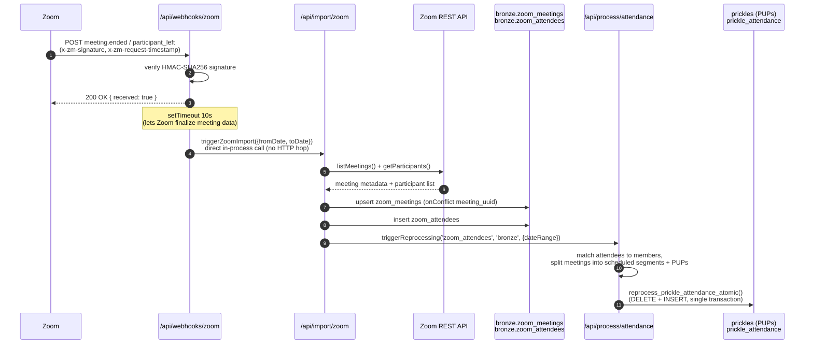
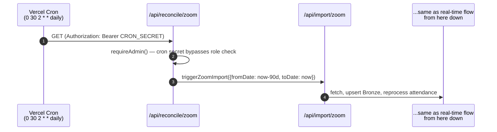
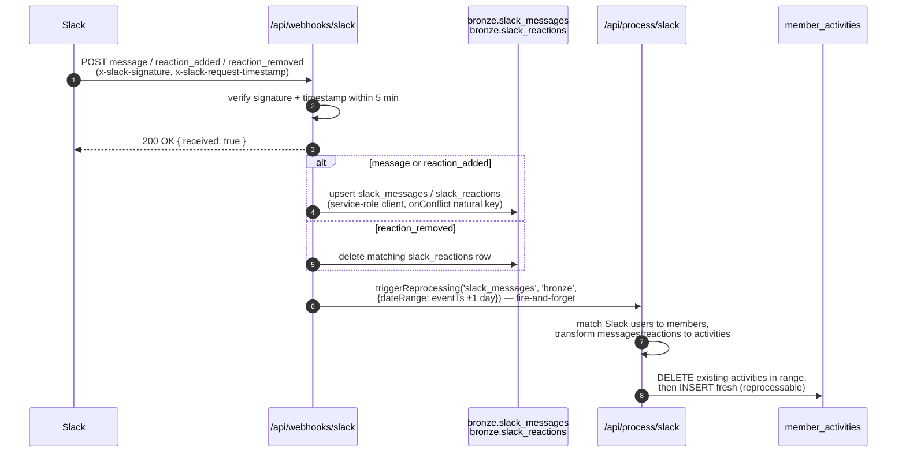
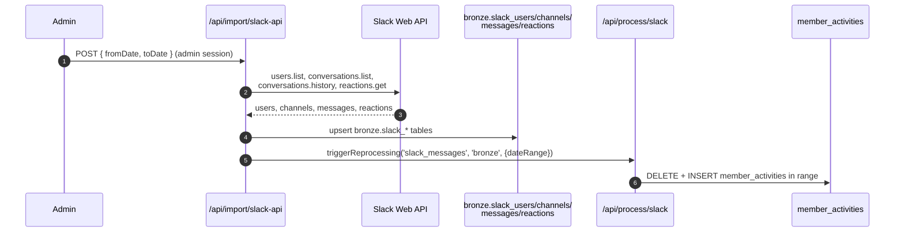
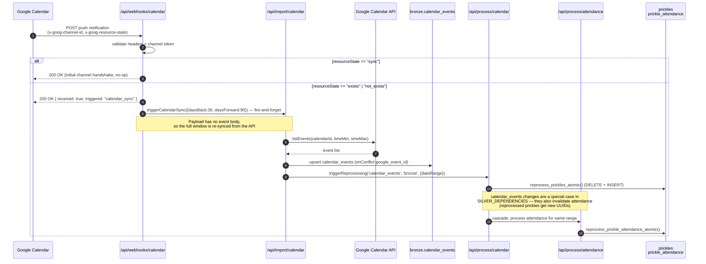
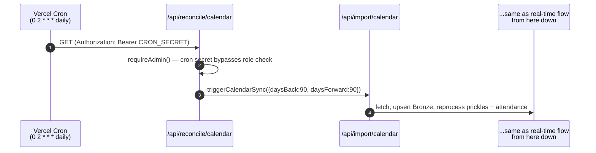
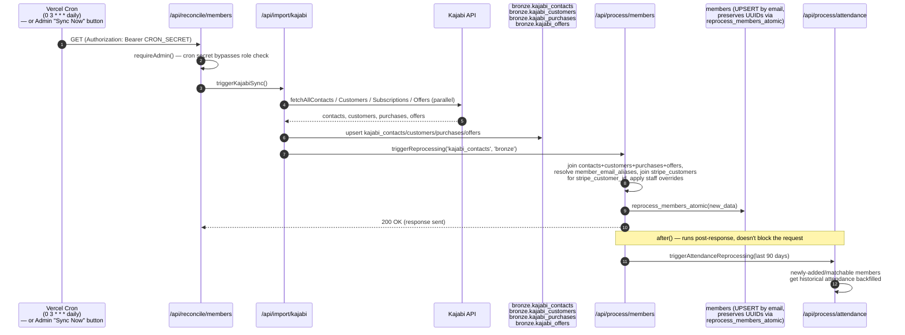
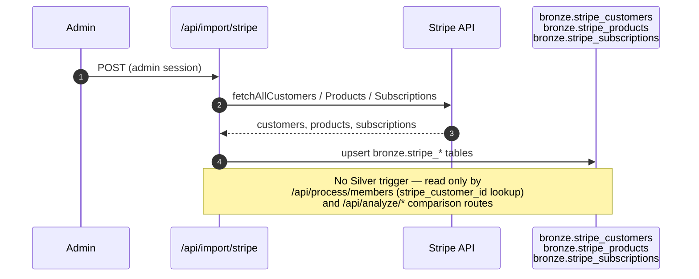

# Integration Sequence Diagrams

How each external integration gets data into the Bronze layer and triggers Silver
reprocessing. Two flavors per integration where applicable:

- **Real-time** — triggered by an inbound webhook from the provider
- **Cron** — triggered nightly by Vercel Cron as a reconciliation backstop

All webhook handlers follow the same shape: verify the signature, respond `200 OK`
immediately (providers retry aggressively on non-2xx/slow responses), then do the
actual work asynchronously (fire-and-forget or `setTimeout`). All cron endpoints are
thin `GET` wrappers — Vercel Cron only issues `GET` requests — that call the same
`trigger*` functions used elsewhere, authenticated via `CRON_SECRET` in
`lib/supabase/api-auth.ts`. See `INTEGRATION_LINKS.md` for webhook URLs/secrets and
`MEDALLION_ARCHITECTURE.md` for the layer model these flows populate.

Downstream Silver reprocessing dependencies (which Bronze/Local change triggers which
Silver table, and the required order) are declared centrally in
`lib/processing/trigger.ts`'s `SILVER_DEPENDENCIES` map — that map is the source of
truth for the reprocessing steps shown below.

---

## Zoom

**Webhook:** `POST /api/webhooks/zoom` (HMAC-SHA256 via `x-zm-signature`) 
**Cron:** `GET /api/reconcile/zoom` — daily at 2:30am, trailing 90-day window

### Real-time flow

### Cron flow

**Why a cron backstop:** the webhook only fires on `meeting.ended` /
`participant_left`, and Zoom's API can be briefly inconsistent right after a
meeting ends. The nightly job re-pulls a trailing 90-day window so any missed or
malformed webhook self-heals within 24 hours.

---

## Slack

**Webhook:** `POST /api/webhooks/slack` (HMAC-SHA256 via `x-slack-signature`, 5-minute replay window) 
**Cron:** none — Slack has no scheduled reconciliation job today (not in `vercel.json`)

### Real-time flow

### Manual backfill (admin-triggered, not scheduled)

There is no cron for Slack. Historical/bulk import is manual only, via two admin
routes that both end by calling the same `triggerReprocessing('slack_messages', ...)`
as the webhook:

- `POST /api/import/slack` — imports a Slack export archive
- `POST /api/import/slack-api` — backfills via the Slack Web API (users, channels,
  messages, reactions) for a date range

---

## Google Calendar

**Webhook:** `POST /api/webhooks/calendar` (token via `x-goog-channel-token`, push channel registered manually — see `WEBHOOK_SETUP.md`) 
**Cron:** `GET /api/reconcile/calendar` — daily at 2am, ±90-day window

### Real-time flow

### Cron flow

**Why a cron backstop:** Google's push channels expire (~7 days) and require manual
re-registration (`WEBHOOK_SETUP.md`); the nightly job with a wider ±90-day window
covers any gap while a channel is dead or a notification is dropped.

---

## Kajabi (Members)

**Webhook:** none in practice — Kajabi's webhooks only fire on "Payment Succeeded" /
"Cart Purchase" and aren't wired up (see `INTEGRATION_LINKS.md`). Member state is
sourced entirely by pulling the Kajabi API. 
**Cron:** `GET /api/reconcile/members` — daily at 3am, full refresh (no date scoping — `members` is an identity entity, not event-scoped)

**Note:** the admin UI's "Sync Now" button calls `POST /api/import/kajabi` directly
(same handler `triggerKajabiSync()` invokes) — same flow, different trigger.

---

## Stripe (comparison only — no cron, no webhook)

Stripe is **not** part of the automated Bronze→Silver pipeline. It exists purely so
admin analysis routes (`/api/analyze/stripe-orphans`,
`/api/analyze/kajabi-stripe-comparison`) can cross-check Kajabi's subscription state
against Stripe's, and so `members.stripe_customer_id` can be populated by an email
join during member processing. Import is manual-only and never calls
`triggerReprocessing`.

